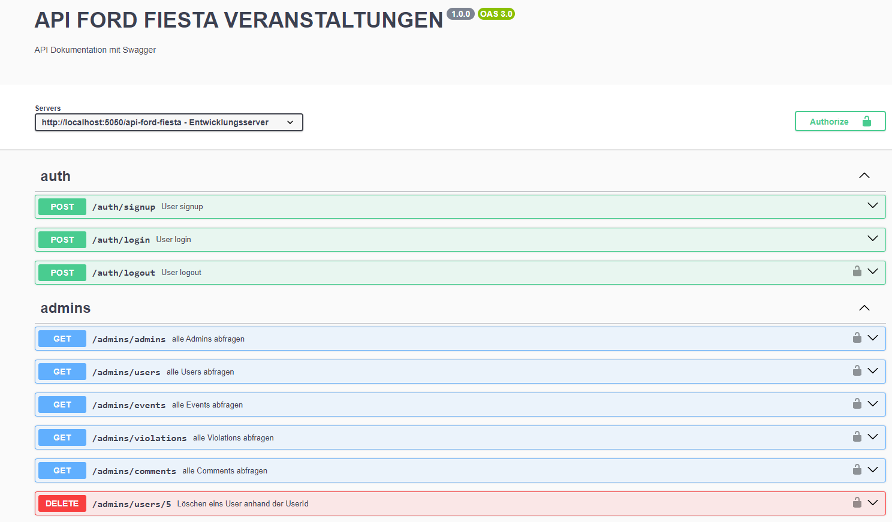

## API-Ford-Fiesta-Veranstaltungen

API für Besitzer und Enthusiasten des Ford Fiesta (Modelljahr 11/2001–08/2008).

### Verzeichnisstruktur

Hier ist eine Übersicht der Verzeichnisstruktur für das Projekt:

```
API-FORD-FIESTA-VERANSTALTUNGEN/
├── database/
│   ├── models/
│   │   ├── Comment.js
│   │   ├── Event.js
│   │   ├── Rating.js
│   │   ├── User.js
│   │   └── Violation.js
│   └── setup/
│       └── database.js
├── middleware/
│   ├── adminMiddleware.js
│   └── userMiddleware.js
├── routes/
│   ├── comments/
│   │   └── index.js
│   ├── events/
│   │   └── index.js
│   ├── ratings/
│   │   └── index.js
│   ├── admins/
│   │   └── index.js
│   ├── users/
│   │   └── index.js
│   └── violations/
│       └── index.js
├── services/
│   ├── auth/
│   │   └── AccessToken.js
│   └── logger.js
├── swagger/
│   ├── admins.yml
│   ├── auth.yml
│   ├── comments.yml
│   ├── events.yml
│   ├── ratings.yml
│   ├── users.yml
│   └── violations.yml
│   └── swaggerConfig.js
├── tests/
│   ├── routes/
│   │   ├── admins/
│   │   │   └── admins.test.js
│   │   ├── comments/
│   │   │   └── comments.test.js
│   │   ├── events/
│   │   │   └── events.test.js
│   │   ├── ratings/
│   │   │   └── ratings.test.js
│   │   ├── users/
│   │   │   └── users.test.js
│   │   ├── violations/
│   │   │   └── violations.test.js
│   ├── setup/
│   │   └── jest.setup.js
│   └── test-env.js
├── .env
├── .env.test.local
├── index.js
├── jest.config.js
└── package.json
```

## API-Dokumentation

Die API-Dokumentation ist über Swagger verfügbar. Du kannst die API-Endpunkte und deren Funktionen wie folgt erkunden:

- **URL zur Swagger-Dokumentation:** [http://localhost:5050/api-docs](http://localhost:5050/api-docs)

### Zugriff auf Swagger-UI

1. **Server starten:**

   ```bash
   npm run dev
   ```

2. **Swagger-UI öffnen:**
   Besuche [http://localhost:5050/api-docs](http://localhost:5050/api-docs) in deinem Webbrowser.

3. **API erkunden:**
   Nutze die Swagger-Oberfläche, um API-Endpunkte zu durchsuchen und zu testen.



## Rate-Limiting

Um eine faire Nutzung der API zu gewährleisten und Missbrauch zu verhindern, haben wir Rate-Limiting implementiert. Hier sind die Details:

- **Rate-Limiting-Policy:**
  - **Zeitfenster:** 15 Minuten
  - **Maximale Anfragen pro IP:** 100 Anfragen pro 15 Minuten
  - **Nachricht bei Überschreitung:** „Zu viele Anfragen von dieser IP-Adresse. Bitte versuche es später erneut.“
  - **Rate-Limit-Header:** Der Rate-Limiter sendet Header in den Antworten, die Informationen über die Rate-Limitierung enthalten.

### Beispiel-Rate-Limit-Header

Wenn du die Rate-Limitierung überschreitest, werden die folgenden Header in den Antworten enthalten sein:

- `X-RateLimit-Limit`: Die maximale Anzahl an Anfragen, die pro Zeitfenster erlaubt sind.
- `X-RateLimit-Remaining`: Die verbleibende Anzahl an Anfragen, die im aktuellen Zeitfenster noch möglich sind.
- `X-RateLimit-Reset`: Der Zeitpunkt, wann die Ratenbegrenzung zurückgesetzt wird (in Sekunden seit der Unix-Zeit).

Hier ist ein Beispiel, wie die Rate-Limit-Header in einer Antwort aussehen könnten:

```
X-RateLimit-Limit: 100
X-RateLimit-Remaining: 0
X-RateLimit-Reset: 1633075200
```
