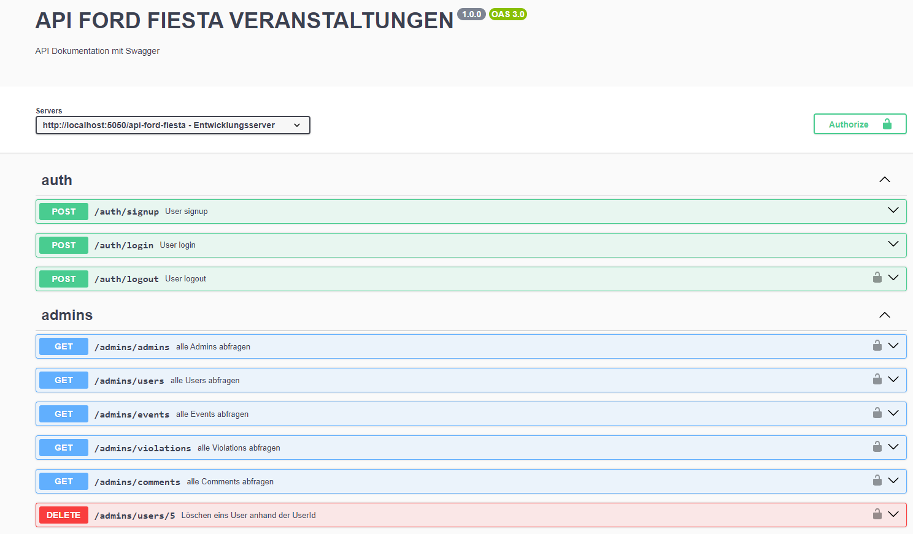

# API-Ford-Fiesta-Veranstaltungen

API für Besitzer und Enthusiasten des Ford Fiesta (Modelljahr 11/2001–08/2008).

## Verzeichnisstruktur

Hier ist eine Übersicht der Verzeichnisstruktur für das Projekt:

```
API-FORD-FIESTA-VERANSTALTUNGEN/
├── database/
│   ├── models/
│   │   ├── Comment.js
│   │   ├── Event.js
│   │   ├── Rating.js
│   │   ├── User.js
│   │   └── Violation.js
│   └── setup/
│       └── database.js
├── middleware/
│   └── authMiddleware.js
├── routes/
│   ├── comments/
│   │   └── index.js
│   ├── events/
│   │   └── index.js
│   ├── ratings/
│   │   └── index.js
│   ├── users/
│   │   └── index.js
│   └── violations/
│       └── index.js
├── services/
│   ├── auth/
│   │   └── AccessToken.js
│   └── logger.js
├── swagger/
│   └── swaggerConfig.js
├── .env
├── index.js
└── package.json
```

## API-Dokumentation

Die API-Dokumentation ist über Swagger verfügbar. Du kannst die API-Endpunkte und deren Funktionen wie folgt erkunden:

- **URL zur Swagger-Dokumentation:** [http://localhost:5050/api-docs](http://localhost:5050/api-docs)

### Zugriff auf Swagger-UI

1. **Server starten:** 
   ```bash
   npm run dev
   ```

2. **Swagger-UI öffnen:** 
   Besuche [http://localhost:5050/api-docs](http://localhost:5050/api-docs) in deinem Webbrowser.

3. **API erkunden:** 
   Nutze die Swagger-Oberfläche, um API-Endpunkte zu durchsuchen und zu testen.


